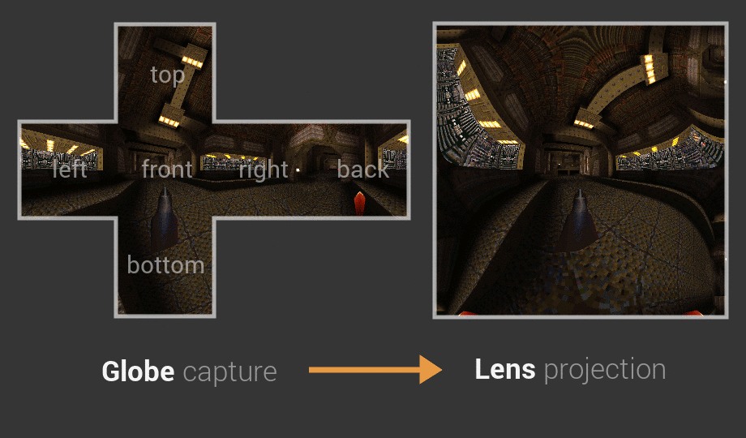

# Blinky


An experiment to __break the 180º Field of View limit in games__.

Blinky is a modification of Quake that allows it reach a 360º FoV.  A fisheye
is one way to do this, but this project also uses map projections from
cartography and other panoramic techniques to explore a myriad of different
views:

[>> Watch a demo video](http://youtu.be/jQOJ3yCK8pI)

### Overview

- continues the work of [Fisheye Quake]
- adds a Lua scripting environment for defining:
  - _Globes_ (for capturing the environment)
  - _Lenses_ (for projecting a wide-angle image)
- uses the cross-platform [TyrQuake] engine for Windows, Mac, and Linux
- includes the Quake demo as a free testing sandbox

### Problem & Solution

All current games and most 3D applications use the standard projection below on
the left, which you can see produces bad distortion when pushing it near its
180º limit.  But using the [Panini] projection on the right allows us to see
wider angles with little distortion.  It even has less distortion than a
standard circular fisheye (e.g.  GoPro), and it maintains the relative shape of
objects, resulting in less nausea.


The image construction happens in two customizable phases.  In the example
below, the environment is captured by a __Cube__ globe, and then projected with
a __Quincuncial__ lens.  Each is defined by a Lua script that you can play with
and swap out for others.



## PLAY

 __[Download for Windows]__  
 __Mac__ (no binaries yet [#71](https://github.com/shaunlebron/blinky/issues/71))  
 __Linux__ (no binaries yet)

### Building from source

After some [manual setup](BUILDING.md) for your OS, you can build/play with:

```
$ ./build.sh
$ ./play.sh
```

### Shortcut Keys


- The command executed by each key will be printed to the top-left of your screen.
- If you actually want to use `1-9` keys for weapon selection, hit `0` to toggle.
- Press `R` for the Rubix grid if you get confused. It makes the
relationship between the Globe & Lens apparent.

### Console Commands

Press `~` to access the command console.  You can use the commands below.

__Pro-Tip:__ use the `Tab` key for help completing a partial command.

```sh
fisheye <0|1>     # enable/disable fisheye mode
f_help            # show quick start options
f_globe <name>    # choose a globe (affects picture quality and render speed)
f_lens <name>     # choose a lens (affects the shape of your view)

f_fov <degrees>   # zoom to a horizontal FOV
f_vfov <degrees>  # zoom to a vertical FOV
f_cover           # zoom in until screen is covered (some parts may be hidden)
f_contain         # zoom out until screen contains the entire image (if possible)

f_rubix           # display colored grid for each rendered view in the globe
f_saveglobe       # take screenshots of each globe face (environment map)
```

### Lua Scripts

To create/edit globes and lenses, check out the following guides:

- [Create a Globe](game/lua-scripts/globes)
- [Create a Lens](game/lua-scripts/lenses)

## Conclusions

- Use Standard projection for FOV ≤ 110º.  Anything more leads to increasing distortion.
- Use Panini or Stereographic lenses for FOV ≤ 200º.  Very practical, shape-preserving lenses with low distortion.
- No preferences for FOV ≤ 360º.  They are more aesthetic than practical.

## Engine Code

- [engine/NQ/fisheye.c](engine/NQ/fisheye.c) - new engine code
- [engine patch](engine/fisheye.patch) - engine modifications

## Future

I hope to apply this to modern graphics using frame buffers for
environment-capturing and pixel shaders for projection.  It would be
interesting to see its impact on performance.

If this modern method is performant enough, I think Panini/Stereographic could
easily become a standard for gamers demanding wide-angle video.  But if it is
not performant enough for live applications, I think it could still prove
useful in post-processed videos using something like [WolfCam].  For example,
spectators could benefit from wide-angle viewings of previously recorded
competitive matches or even [artistic montages].

## Thanks

This project would not exist without these people!

- __Wouter van Oortmerssen__ for creating & open-sourcing [Fisheye Quake]
- __Peter Weiden__ for creating [fisheye diagrams] on Wikipedia
- __Kevin Shanahan__ for creating/maintaining a cross-platform Quake engine, [TyrQuake]

## License

Copyright © 2011-2015 Shaun Williams

The MIT License


[Fisheye Quake]:http://strlen.com/gfxengine/fisheyequake/
[TyrQuake]:http://disenchant.net/tyrquake/
[Panini]: http://tksharpless.net/vedutismo/Pannini/
[Quincuncial]:http://en.wikipedia.org/wiki/Peirce_quincuncial_projection
[artistic montages]:http://youtu.be/-T6IAHWMd2I
[WolfCam]:http://www.wolfcamql.fr/en
[Download for Windows]:https://github.com/shaunlebron/blinky/releases/download/1.2/blinky-1.2-windows.zip
[fisheye diagrams]:http://en.wikipedia.org/wiki/Fisheye_lens#Mapping_function
