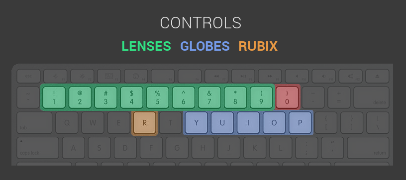
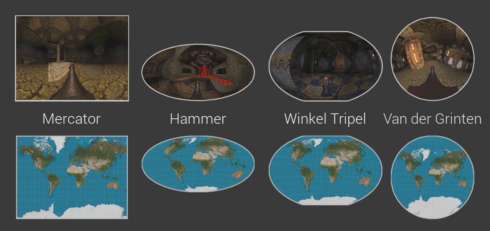
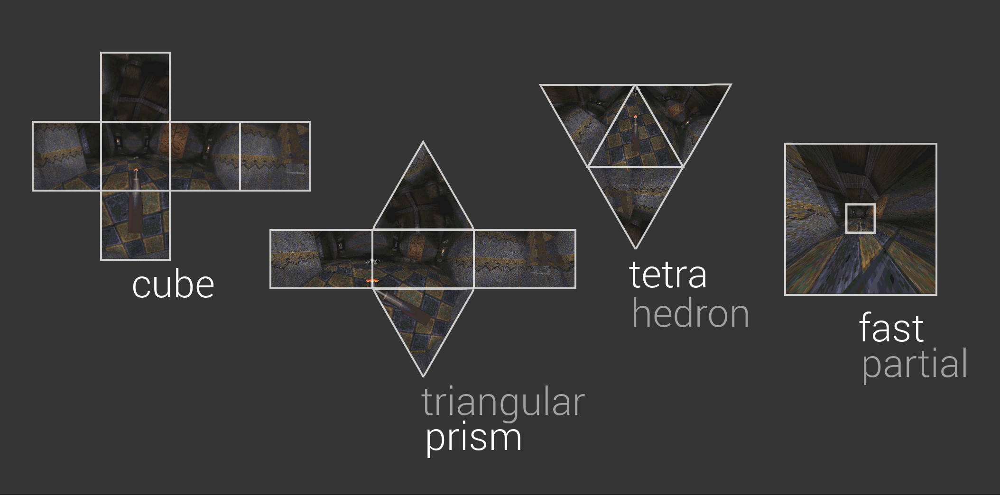

# Blinky


Proof of concept to __put peripheral vision into games__ (without VR goggles).
Explore this interesting space by playing the _Quake demo_ with fisheyes,
panoramas, and cartographic projections.

 [Download for Windows](https://github.com/shaunlebron/blinky/releases/download/1.3/blinky-1.3-windows.zip)  
 [Download for Mac](https://github.com/shaunlebron/blinky/releases/download/1.3/blinky-1.3-mac.zip)  
 (Help with linux, [issue #74](https://github.com/shaunlebron/blinky/issues/74))

### Overview

[>> Watch a demo video](http://youtu.be/jQOJ3yCK8pI)

__Why?__ The standard projection used in all games was never intended for
wide-angle views, whereas the [Panini] projection was invented to be the best
representation of your natural ~170º wide vision.

[](https://raw.githubusercontent.com/shaunlebron/blinky/master/readme-img/old-and-new.jpg)

__How?__ To use non-standard projections like Panini, Blinky first snaps
multiple pictures around you to form a _Globe_ of pixels.  Then it projects
all those pixels to the screen using a _Lens_.  You can enable a _Rubix_
grid if you wish to visualize the mapping.  ([Quincuncial] projection shown below)

[](https://raw.githubusercontent.com/shaunlebron/blinky/master/readme-img/map.gif)

__Try it:__ Blinky has shortcut keys for quickly trying several Globes and
Lenses.  If you want more control, use the [console
commands](#console-commands) or even [edit/create](#lua-scripts) your own
globes and lenses with Lua scripts.

[](https://raw.githubusercontent.com/shaunlebron/blinky/master/readme-img/keys.png)

__360º vision:__ Blinky has many fisheye and panoramic lenses from photography,
but it also has many map projections from cartography that will give you a full
360º view.

[](https://raw.githubusercontent.com/shaunlebron/blinky/master/readme-img/worlds.jpg)

__Performance vs Quality:__ Blinky has to render 6 views per frame when using a
_Cube_ globe.  So we provide lower poly globes as a way to balance quality and
performance.  Fewer renders means each view has to cover more area with less
resolution.

[](https://raw.githubusercontent.com/shaunlebron/blinky/master/readme-img/globes.jpg)

## Technical Details

Blinky is a modification of the famous [Fisheye Quake].

- adds a Lua scripting environment for defining:
  - _Globes_ (for capturing the environment)
  - _Lenses_ (for projecting a wide-angle image)
- uses the cross-platform [TyrQuake] engine for Windows, Mac, and Linux

### Building from source

After some [manual setup](BUILDING.md) for your OS, you can build/play with:

```
$ ./build.sh
$ ./play.sh
```

### Console Commands

Press `~` to access the command console.  Use the `Tab` key for help completing
a partial command.

```sh
fisheye <0|1>     # enable/disable fisheye mode
f_help            # show quick start options
f_globe <name>    # choose a globe (affects picture quality and render speed)
f_lens <name>     # choose a lens (affects the shape of your view)

f_fov <degrees>   # zoom to a horizontal FOV
f_vfov <degrees>  # zoom to a vertical FOV
f_cover           # zoom in until screen is covered (some parts may be hidden)
f_contain         # zoom out until screen contains the entire image (if possible)

f_rubix           # display colored grid for each rendered view in the globe
f_saveglobe       # take screenshots of each globe face (environment map)
```

### Lua Scripts

To create/edit globes and lenses, check out the following guides:

- [Create a Globe](game/lua-scripts/globes)
- [Create a Lens](game/lua-scripts/lenses)

### Engine Code

- [engine/NQ/fisheye.c](engine/NQ/fisheye.c) - new engine code
- [engine patch](engine/fisheye.patch) - engine modifications

## Future

I hope to apply this to modern graphics using frame buffers for
environment-capturing and pixel shaders for projection.  It would be
interesting to see its impact on performance.

If this modern method is performant enough, I think Panini/Stereographic could
easily become a standard for gamers demanding wide-angle video.  But if it is
not performant enough for live applications, I think it could still prove
useful in post-processed videos using something like [WolfCam].  For example,
spectators could benefit from wide-angle viewings of previously recorded
competitive matches or even [artistic montages].

## Thanks

This project would not exist without these people!

- __Wouter van Oortmerssen__ for creating & open-sourcing [Fisheye Quake]
- __Peter Weiden__ for creating [fisheye diagrams] on Wikipedia
- __Kevin Shanahan__ for creating/maintaining a cross-platform Quake engine, [TyrQuake]

## Contact

- email: <shaun.e.williams@gmail.com>
- twitter: [@shaunlebron](http://twitter.com/shaunlebron)

## License

Copyright © 2011-2015 Shaun Williams

The MIT License


[Fisheye Quake]:http://strlen.com/gfxengine/fisheyequake/
[TyrQuake]:http://disenchant.net/tyrquake/
[Panini]: http://tksharpless.net/vedutismo/Pannini/
[Quincuncial]:http://en.wikipedia.org/wiki/Peirce_quincuncial_projection
[artistic montages]:http://youtu.be/-T6IAHWMd2I
[WolfCam]:http://www.wolfcamql.fr/en
[fisheye diagrams]:http://en.wikipedia.org/wiki/Fisheye_lens#Mapping_function
